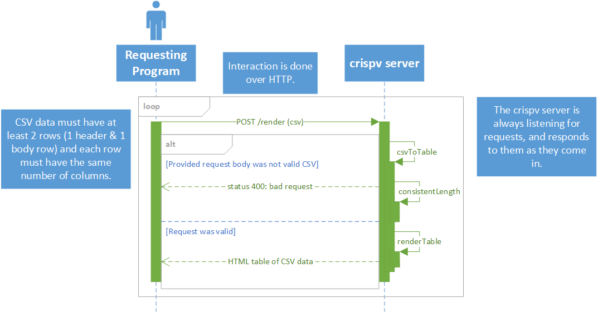

# crispv

> *It's like CSV, but crunchier!* (???)

A small web app/microservice™ for converting CSV data to HTML tables.

## Requesting & Receiving Data

All interaction with `crispv` is done via a single HTTP endpoint, `/render`.
CSV data should be send via POST request, header row and all, without URL-encoding.
Here is a sample request using cURL, together with the expected HTTP response:

```sh
$ curl https://$CRISPV_ENDPOINT/render -d $'a,b,c\n1,2,3'
<table class="crispv-table"><tr><th>a</th><th>b</th><th>c</th></tr><tr><td>1</td><td>2</td><td>3</td></tr></table>
```

If invalid CSV data is sent, the response will instead be "bad request," e.g.

```sh
# row length mismatch
$ curl https://$CRISPV_ENDPOINT/render -d a,b,c\n1,2
bad request
```

A full rendering request/response interaction is also illustrated in the following UML sequence diagram:



### Portability:
Some shells are weird, so the sample request may not play nice. If you are having issues, you can use `echo` to feed data directly:

```sh
echo -e "1,2,3\n4,5,6" | curl http://localhost:8000/render --data-binary "@-"
```

### Docker
This project has been dockerized for easy, 1 line setup. Assuming CI works properly, you should be able to spin up a crispv instance locally by running the following command:

```sh
$ docker run --rm -p 8000:8000 ghcr.io/5t0n3/crispv:v0.1.0.1
# note the version number may change, see releases for info
```

After doing so, the endpoint will be available on http://localhost:8000/render.